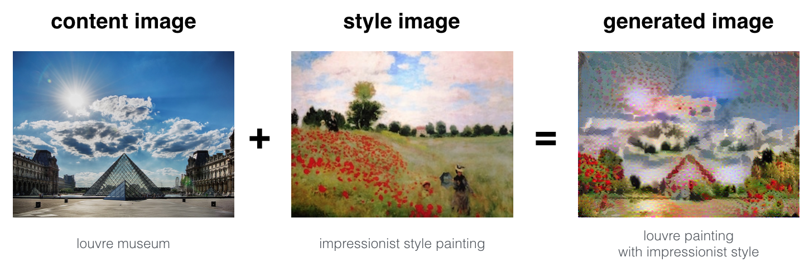

# Art-Generation-With-Neural-Style-Transfer
Neural Style Transfer (NST) is one of the most fun and interesting optimization techniques in deep learning. It merges two images, namely: a "content" image (C) and a "style" image (S), to create a "generated" image (G). The generated image G combines the "content" of the image C with the "style" of image S.

In this project I combined the Louvre museum in Paris (content image C) with the impressionist style of Claude Monet (content image S) to generate the following image:

